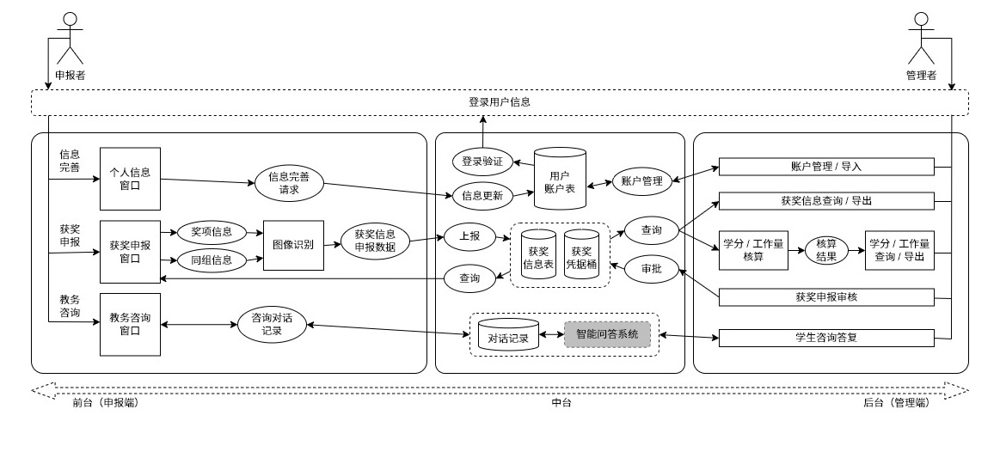

# 基于大模型的学科竞赛智能管理系统开发

## 一、选题的目的和意义

当前，人工智能在软件开发中的应用正逐步深化，AI 辅助开发方法成为提升软件工程效率和质量的重要趋势。AI 技术早已今非昔比，与传统开发方式相比，AI 在代码自动生成、优化和测试方面展现出巨大潜力。如何将 AI 技术有效融入软件开发流程，提升开发效率和代码质量，是当前软件工程领域的研究热点。本项目旨在研究 AI 如何在软件工程实践中提升开发效率、优化代码质量，并减少人工干预，而获奖管理系统则是该方法论的实验载体。

当前许多高校的获奖管理系统较为简陋，存在多个痛点：数据录入、审核和查询流程高度依赖人工操作，缺乏智能化数据处理；管理系统往往无法与咨询系统联动，导致信息孤岛问题严重；此外，系统升级和功能扩展缓慢，难以适应高校日益增长的管理需求。因此，迫切需要一套更为智能化、自动化的获奖管理系统。本项目选择该应用场景，不仅是为了解决实际痛点，更是为 AI 辅助开发方法提供一个理想的实践平台。

在方法论研究方面，本项目希望突破传统的人工开发模式，采用大模型驱动的自动化开发与测试流程，以提升软件工程的智能化水平。通过集成 Cursor 作为开发工具，并结合 Dify 和 LangGraph 的 Agent 工作流，我们将探索基于 AI 的微单元开发和测试，使代码的编写、优化和调试过程更加高效智能。此外，本项目还将采用 Vue.js 作为前端框架，结合 FastAPI 构建高效的后端系统，以实现前后端分离、响应式界面设计和高性能 API 服务。

从研究价值来看，本项目不仅关注 AI 辅助开发方法的探索，还希望通过实际应用场景验证其有效性。近年来，代码自动生成、智能补全、自动化测试等 AI 技术逐渐成熟，但如何将这些技术有效融入完整的软件开发流程，仍然是一个值得深入研究的问题。大语言模型 (LLM) 的应用也不止是诸如 ChatGPT、DeepSeek Chat 这类的对话系统，在由于代码生成时，我们需要一个更加专业的结构——即 Agent。Agent 是一个可以在代码中进行操作的实体，它可以在代码中进行操作，如添加、删除、修改代码等。本项目将通过完整的实践过程，评估 AI 驱动的软件开发模式在真实应用中的可行性，并为未来更大规模的软件工程变革提供参考。

在实际应用方面，本系统将为高校教务管理人员、教师和学生提供更加高效、智能的竞赛信息管理平台。系统不仅支持获奖信息的录入、审核和查询，还能利用图像识别技术自动识别获奖证书，提高数据录入效率，并支持与高校其他教务管理平台的对接，确保数据一致性和可拓展性。

总体而言，本项目的研究价值体现在两个方面：一是通过 AI 辅助开发方法提升软件开发的智能化水平，提高代码质量和开发效率；二是通过 AI 驱动的学科竞赛管理系统优化高校的竞赛管理流程，为 AI 在软件开发中的实践应用提供宝贵经验。

## 二、研究现状、开题前的准备工作以及初步系统方案设计

### 1. 研究现状

#### 1.1 大模型 Agent 的技术现状

#### 1.2 人工智能辅助开发的技术现状

### 2. 开题前的准备工作

#### 2.1 软件需求分析


#### 2.2 开发工具及技术选型

### 3. 初步系统方案设计

#### 3.1 辅助开发工具的架构设计


#### 3.2 教务学科竞赛管理系统的结构设计




## 三、毕业论文（设计）的进度安排

|     | 各阶段内容                             | 起止时间                |
| --- | -------------------------------------- | ----------------------- |
| 1   | 查阅所需中英文文献、提交开题报告       | 3 月 2 日 ~ 4 月 7 日   |
| 2   | 完成人工智能辅助开发工具具体设计       | 3 月 11 日 ~ 4 月 20 日 |
| 3   | 搭建人工智能辅助开发工具               | 4 月 20 日 ~ 5 月 20 日 |
| 4   | 完成整体系统最终设计实现及论文初稿工作 | 5 月 5 日 ~ 6 月 4 日   |
| 5   | 提交最终毕业论文，答辩                 | 6 月 4 日 ~ 6 月 11 日  |

## 四、毕业论文（设计）的主要内容

```plaintext
第一章 绪论
    1.1 课题研究背景及意义
    1.2 研究现状
    1.3 本课题研究内容
    1.4 论文的组织结构
第二章 相关技术介绍
    2.1 人工智能辅助开发应用介绍
    2.2 基于 Agent 的开发流程介绍
    2.3 Vue.js + FastAPI 前后端框架介绍
    2.4 系统方案和开发环境介绍
    2.5 本章小结
第三章 系统设计
    3.1 辅助开发工作流的结构设计
    3.2 获奖管理系统需求分析和整体设计
    3.4 本章小结
第四章 辅助开发工作流
    4.1 辅助开发工具的架构设计
    4.2 辅助开发工具的实现
    4.3 本章小结
第五章 获奖管理系统
    5.1 教务学科竞赛管理系统的结构设计
    5.2 教务学科竞赛管理系统的实现
    5.3 教务学科竞赛管理系统的测试
    5.4 本章小结
第六章 总结与展望
    6.1 系统开发总结
    6.2 系统展望
致谢
参考文献
附录
```
