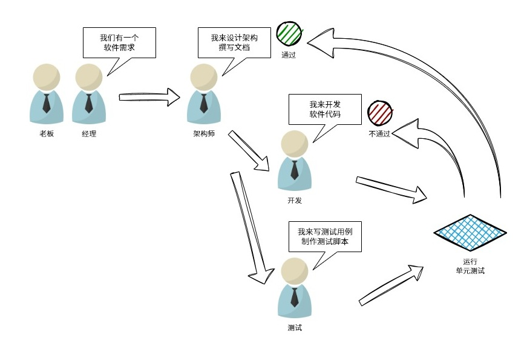
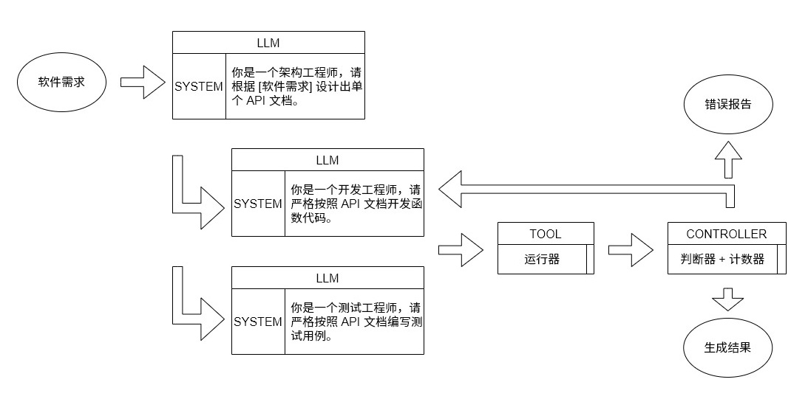

# 基于大模型的学科竞赛智能管理系统开发

## 一、选题的目的和意义

## 二、研究现状、开题前的准备工作以及初步系统方案设计

### 1. 研究现状

#### 1.1 大模型 Agent 的技术现状

#### 1.2 人工智能辅助开发的技术现状

### 2. 开题前的准备工作

#### 2.1 软件需求分析


#### 2.2 开发工具及技术选型

### 3. 初步系统方案设计

#### 3.1 辅助开发工具的架构设计





#### 3.2 教务学科竞赛管理系统的结构设计


## 三、毕业论文（设计）的进度安排

|     | 各阶段内容                             | 起止时间                |
| --- | -------------------------------------- | ----------------------- |
| 1   | 查阅所需中英文文献、提交开题报告       | 3 月 2 日 ~ 4 月 7 日   |
| 2   | 完成人工智能辅助开发工具具体设计       | 3 月 11 日 ~ 4 月 20 日 |
| 3   | 搭建人工智能辅助开发工具               | 4 月 20 日 ~ 5 月 20 日 |
| 4   | 完成整体系统最终设计实现及论文初稿工作 | 5 月 5 日 ~ 6 月 4 日   |
| 5   | 提交最终毕业论文，答辩                 | 6 月 4 日 ~ 6 月 11 日  |

## 四、毕业论文（设计）的主要内容

```plaintext
第一章 绪论
    1.1 课题研究背景及意义
    1.2 研究现状
    1.3 本课题研究内容
    1.4 论文的组织结构
第二章 相关技术介绍
    2.1 人工智能辅助开发应用介绍
    2.2 基于 Agent 的开发流程介绍
    2.3 Vue.js + FastAPI 前后端框架介绍
    2.4 系统方案和开发环境介绍
    2.5 本章小结
第三章 系统设计
    3.1 辅助开发工作流的结构设计
    3.2 获奖管理系统需求分析和整体设计
    3.4 本章小结
第四章 辅助开发工作流
    4.1 辅助开发工具的架构设计
    4.2 辅助开发工具的实现
    4.3 本章小结
第五章 获奖管理系统
    5.1 教务学科竞赛管理系统的结构设计
    5.2 教务学科竞赛管理系统的实现
    5.3 教务学科竞赛管理系统的测试
    5.4 本章小结
第六章 总结与展望
    6.1 系统开发总结
    6.2 系统展望
致谢
参考文献
附录
```
